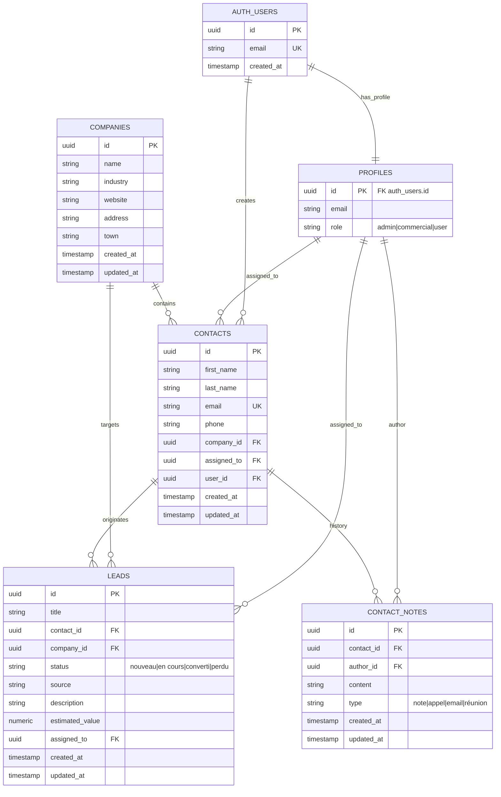

# ER Diagram - Version alignée au périmètre implémenté

## Notes

- Le statut lead utilise les valeurs réelles de l'application: nouveau, en cours, converti, perdu.
- Les entités tasks/emailings sont volontairement exclues de ce diagramme car non implémentées dans la version actuelle.
