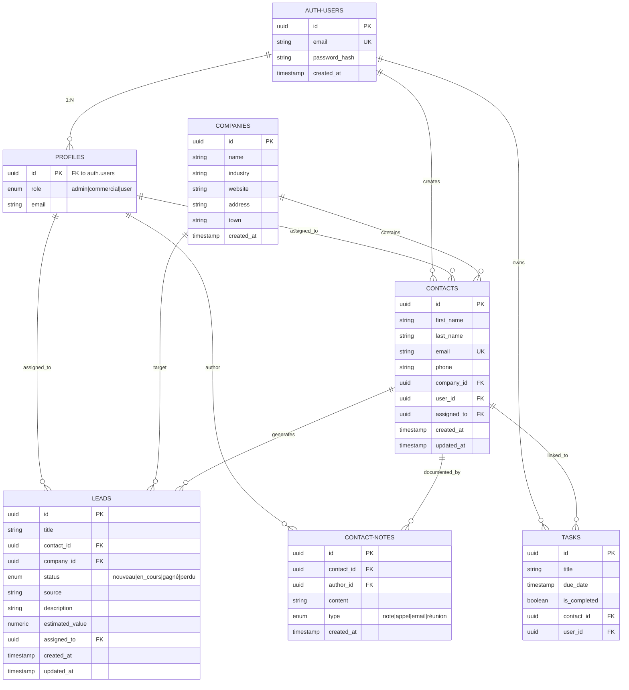

# Diagramme ER - Entity Relationship Diagram

## Visualisation Complète

## Légende

- **PK** = Primary Key (Clé primaire)
- **FK** = Foreign Key (Clé étrangère)
- **UK** = Unique Key (Contrainte d'unicité)
- **||--o{** = 1:N (One to Many)
- **enum** = Énumération (valeurs prédéfinies)

